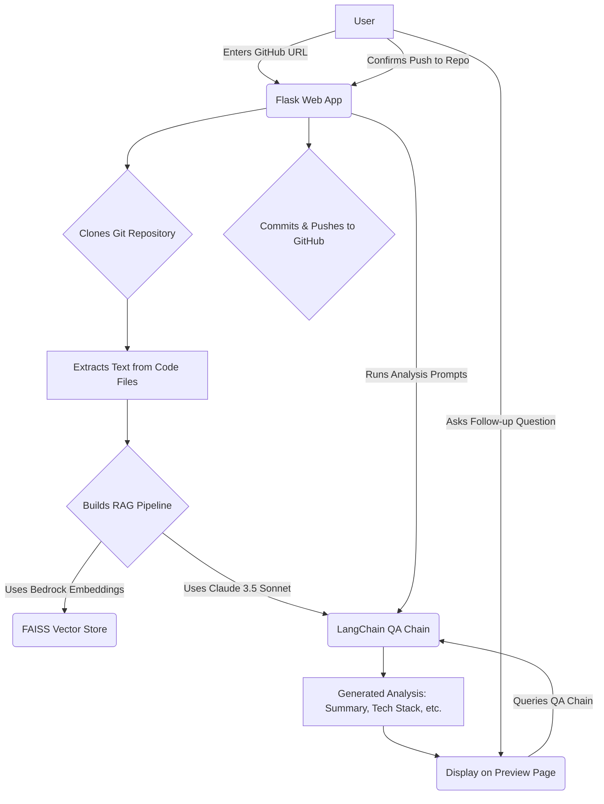
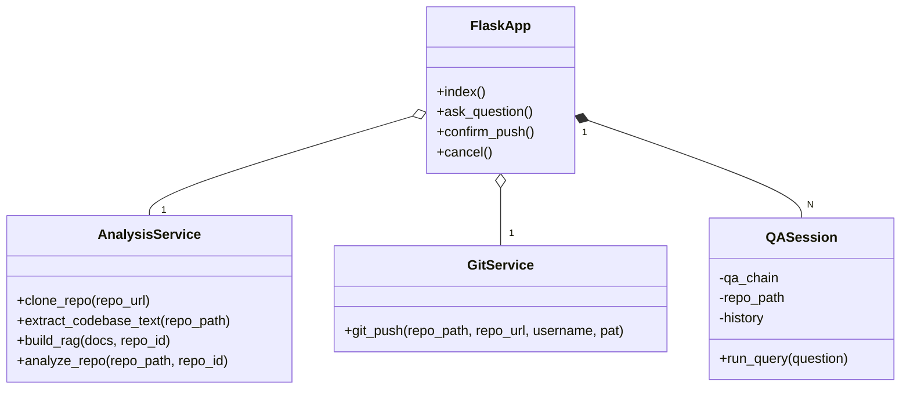

# RepoIQ

This web application provides a comprehensive analysis of GitHub repositories using AI. It clones a given repository, builds a knowledge base, and generates a detailed overview including a summary, technology stack, developer guide, and potential improvements. It also features an interactive Q&A chat to query the codebase.

## Features

- **Automated Repository Analysis:** Get a deep understanding of any public GitHub repository.
- **Codebase Summary:** Automatically generates a high-level summary of the repository's purpose and main components.
- **Technology Stack Detection:** Identifies the key languages, frameworks, and tools used in the project.
- **Developer Guide Generation:** Creates a detailed guide for developers to get started with the repository.
- **Best Practices & Scalability Suggestions:** Offers recommendations for improving the codebase.
- **Diagram Generation:** Produces Mermaid diagrams for system design and UML (Class and Sequence diagrams).
- **Interactive Q&A:** Ask questions about the codebase in natural language.
- **Push to Repo:** Option to commit the generated analysis back to the original repository.

## Workflow

1.  **Clone Repository:** The user provides a GitHub repository URL. The application clones it into a temporary directory.
2.  **Extract Code:** The application traverses the repository, reading the content of all source code files with common extensions.
3.  **Build RAG Pipeline:**
    - The extracted text is split into manageable chunks.
    - **LangChain** and **AWS Bedrock Embeddings** are used to create vector embeddings for each chunk.
    - A **FAISS** vector store is created from the embeddings for efficient similarity searches.
    - A Retrieval-Augmented Generation (RAG) QA chain is set up with a **ChatBedrock** model (Claude 3.5 Sonnet).
4.  **Generate Analysis:** The application runs a series of pre-defined questions through the RAG pipeline to generate:
    - Repository Summary
    - Tech Stack
    - Developer Guide
    - Improvement Suggestions
    - Mermaid System Design Diagram
    - Mermaid UML Diagrams
5.  **Interactive Session:**
    - The analysis is displayed on a preview page.
    - The user can ask follow-up questions, which are answered by the RAG pipeline.
6.  **Push Changes (Optional):** The user can provide their GitHub credentials to commit the generated analysis files into a new branch on the original repository.
7.  **Cleanup:** The temporary directory containing the cloned repository is deleted after the session ends.

## Tech Stack

- **Backend:** Python, Flask
- **AI/ML:**
    - `langchain`: Framework for developing applications powered by language models.
    - `langchain-aws`: Integration for AWS Bedrock.
    - `boto3`: AWS SDK for Python.
    - `faiss-cpu`: Library for efficient similarity search.
- **Git Operations:** `GitPython`
- **Frontend:** HTML, CSS, JavaScript
- **Deployment:** Docker (Dockerfile provided)

## Setup and Installation

### Prerequisites

- Python 3.8+
- An AWS account with access to Amazon Bedrock, specifically the `anthropic.claude-3-5-sonnet` and `amazon.titan-embed-text-v1` models.
- Configure your AWS credentials locally so that `boto3` can access them. You can do this by installing the AWS CLI and running `aws configure`.

### Installation

1.  **Clone the repository:**
    ```bash
    git clone <your-repo-url>
    cd AISERVICES2
    ```

2.  **Install the dependencies:**
    ```bash
    pip install -r requirements.txt
    ```

### Running the Application

1.  **Start the Flask server:**
    ```bash
    python app.py
    ```

2.  **Access the application:**
    Open your web browser and navigate to `http://127.0.0.1:5000`.

## How to Use

1.  **Enter Repository URL:** On the home page, enter the HTTPS URL of the public GitHub repository you want to analyze.
2.  **View Analysis:** The application will process the repository and display the generated summary, tech stack, guides, and diagrams on the preview page.
3.  **Ask Questions:** Use the chat interface on the preview page to ask specific questions about the repository's code.
4.  **Push to GitHub (Optional):** If you want to save the analysis, click the "Confirm Push" button. You will be prompted to enter your GitHub username and a Personal Access Token (PAT) with `repo` scope. The analysis will be committed and pushed to a new branch in your repository.
5.  **Cancel:** You can cancel the process at any time, which will clean up the cloned repository from the server.

## Example Diagrams

Here are examples of the types of diagrams the application can generate.

### System Design Diagram



### UML Class Diagram



