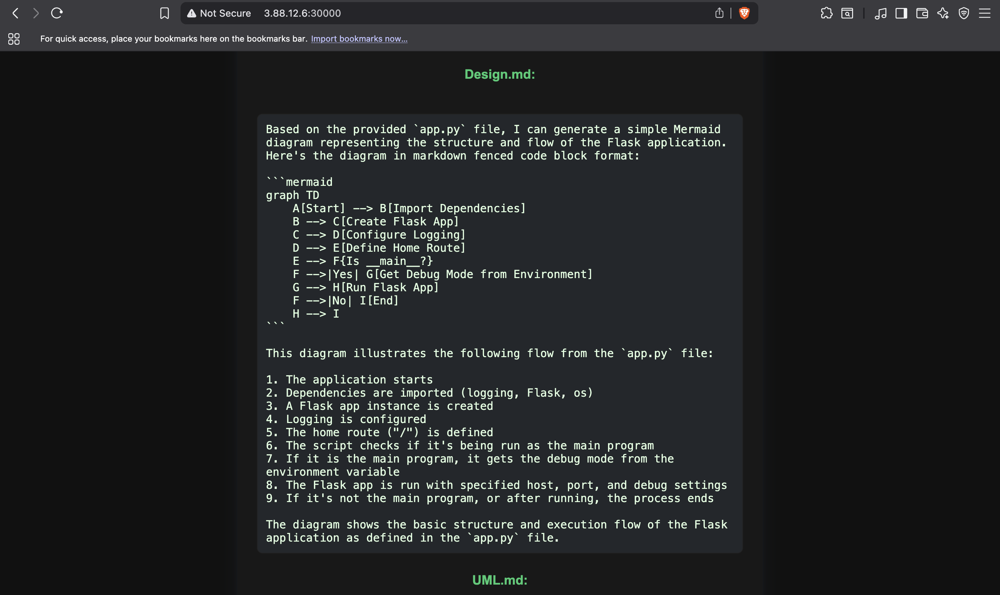

# Project Working Screenshots

Here are some working screenshots of the project:

## Screenshots

### Screenshot 1


### Screenshot 2


### Screenshot 3


### Screenshot 4


### Screenshot 5


### Screenshot 6


### Screenshot 7


### Screenshot 8


### Screenshot 9


# RepoIQ

RepoIQ is an AI-powered web application that provides deep, automated analysis of any public GitHub repository. It clones a repository, builds a knowledge base using advanced language models, and generates a comprehensive overview including a summary, technology stack, developer guide, improvement suggestions, and interactive Q&A. The app can also generate system design and UML diagrams, and optionally push the generated analysis back to the original repository.

---

## Table of Contents

- [Features](#features)
- [How It Works](#how-it-works)
- [Tech Stack](#tech-stack)
- [Architecture & Design](#architecture--design)
- [Workflow](#workflow)
- [Setup & Installation](#setup--installation)
- [Usage Guide](#usage-guide)
- [Example Diagrams](#example-diagrams)
- [FAQ](#faq)

---

## Features

- **Automated Repository Analysis:** Understand any public GitHub repository in minutes.
- **Codebase Summary:** High-level summary of the repository's purpose and main components.
- **Technology Stack Detection:** Identifies languages, frameworks, and tools used.
- **Developer Guide Generation:** Step-by-step guide for onboarding developers.
- **Best Practices & Scalability Suggestions:** Recommendations for codebase improvement.
- **Diagram Generation:** Mermaid diagrams for system design and UML (Class and Sequence diagrams).
- **Interactive Q&A:** Ask questions about the codebase in natural language.
- **Push to Repo:** Optionally commit the generated analysis back to the original repository.

---

## How It Works

1. **Clone Repository:** User submits a GitHub URL; the app clones the repo into a temporary directory.
2. **Extract Code:** The app reads all source code files with common extensions.
3. **Build RAG Pipeline:**
    - Splits code into manageable chunks.
    - Uses LangChain and AWS Bedrock Embeddings to create vector embeddings.
    - Stores embeddings in a FAISS vector store for similarity search.
    - Sets up a Retrieval-Augmented Generation (RAG) QA chain with Claude 3.5 Sonnet.
4. **Generate Analysis:** Runs prompts to generate:
    - Repository Summary
    - Tech Stack
    - Developer Guide
    - Suggestions for improvement
    - Mermaid System Design and UML diagrams
5. **Interactive Session:** User can ask questions about the codebase via chat.
6. **Push Changes (Optional):** User can commit the generated analysis to a new branch in the original repo.
7. **Cleanup:** Temporary files are deleted after the session.

---

## Tech Stack

- **Backend:** Python, Flask
- **AI/ML:** LangChain, langchain-aws, boto3, faiss-cpu
- **Git Operations:** GitPython
- **Frontend:** HTML, CSS, JavaScript
- **Deployment:** Docker (see `Dockerfile`)

---

## Architecture & Design

### High-Level Architecture

1. **Frontend (Flask + HTML/CSS/JS):**
    - Accepts GitHub repo URL input
    - Displays analysis, diagrams, and Q&A chat
2. **Backend (Flask):**
    - Handles repo cloning, code extraction, and analysis
    - Manages RAG pipeline and Q&A
    - Handles Git operations for push
3. **AI/ML Pipeline:**
    - Uses LangChain with AWS Bedrock (Claude 3.5 Sonnet, Titan Embeddings)
    - Stores embeddings in FAISS for fast retrieval

### Key Components

- `app.py`: Flask app entry point and route definitions
- `services/analyzer.py`: Core logic for code extraction and analysis
- `services/rag_pipeline.py`: RAG pipeline setup and query handling
- `services/repo_manager.py`: Repo cloning and management
- `services/session_store.py`: Session and state management
- `templates/`: HTML templates for UI
- `static/`: CSS and static assets

---

## Workflow

1. **User enters a GitHub repo URL** on the home page.
2. **App clones the repo** and extracts code files.
3. **RAG pipeline is built** using AWS Bedrock and FAISS.
4. **Predefined prompts generate analysis** and diagrams.
5. **User can interact via Q&A chat** to ask about the codebase.
6. **Optionally, analysis is pushed** to a new branch in the repo.
7. **Temporary files are cleaned up** after the session.

---

## Setup & Installation

### Prerequisites

- Python 3.8+
- AWS account with access to Amazon Bedrock (Claude 3.5 Sonnet, Titan Embeddings)
- AWS CLI configured locally (`aws configure`)

### Installation

1. **Clone the repository:**
    ```bash
    git clone <your-repo-url>
    cd RepoIQ
    ```
2. **Install dependencies:**
    ```bash
    pip install -r requirements.txt
    ```

### Running the Application

1. **Start the Flask server:**
    ```bash
    python app.py
    ```
2. **Access the app:**
    Open your browser at [http://127.0.0.1:5000](http://127.0.0.1:5000)

### Docker (Optional)

To run with Docker:

```bash
docker build -t repoiq .

```

---

## Usage Guide

1. **Enter Repository URL:** On the home page, enter the HTTPS URL of the public GitHub repository you want to analyze.
2. **View Analysis:** The app processes the repo and displays the generated summary, tech stack, guides, and diagrams on the preview page.
3. **Ask Questions:** Use the chat interface to ask about the codebase.
4. **Push to GitHub (Optional):** Click "Confirm Push" and provide your GitHub username and a Personal Access Token (PAT) with `repo` scope. The analysis will be committed and pushed to a new branch.
5. **Cancel:** You can cancel at any time, which cleans up the cloned repo from the server.

---

### System Design Diagram


### UML Class Diagram


### UML Class Diagram


